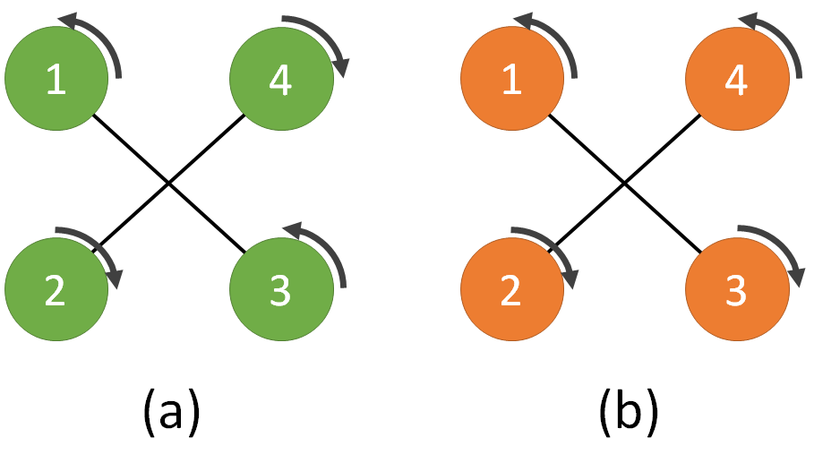

### Deliverable 1 - Transformations in Practice (10 pts)
This exercise will help you to understand how to perform transformation between different rotation representations using ROS. In addition, you will gain experience of reading through a documentation in order to find what you need.

#### A. Message vs. tf
In ROS, there are two commonly used datatypes for quaternions. One is `geometry_msgs::msg::Quaternion` and the other is `tf2::Quaternion`. Based on the documentation for tf2 and the tf2 tutorials, answer the following questions:

1. Assume we have an incoming `geometry_msgs::msg::Quaternion quat_msg` that holds the pose of our robot. We need to save it in an already defined `tf2::Quaternion quat_tf` for further calculations. Write one line of C++ code to accomplish this task.

    _Answer:_
    ```
    tf2::Quaternion quat_tf = tf2::fromMsg(quat_msg);
    ```

2. Assume we have just estimated our robot’s newest rotation and it’s saved in a variable called quat_tf of type `tf2::Quaternion`. Write one line of C++ code to convert it to a `geometry_msgs::msg::Quaternion` type. Use quat_msg as the name of the new variable.

    _Answer:_
    ```
    geometry_msgs::msg::Quaternion quat_msg = tf2::toMsg(quat_tf);
    ```

3. If you just want to know the scalar value of a tf2::Quaternion, what member function will you use?

    _Answer:_
    ```
    .w()
    ```

#### B. Conversion
The following questions will prepare you for converting between different rotation representations in C++ and ROS.

1. Assume you have a tf2::Quaternion quat_t. How to extract the yaw component of the rotation with just one function call?

    _Answer:_
    ```
    double yaw = tf2::getYaw(quat_t);
    ```

2. Assume you have a geometry_msgs::msg::Quaternion quat_msg. How to you convert it to an Eigen 3-by-3 matrix? Refer to this and this for possible functions. You probably need two function calls for this.

    _Answer:_
    ```
    Eigen::Quaterniond quat_tf;
    tf2::fromMsg(quat_msg, quat_tf);
    Eigen::Matrix3d R = quat_tf.toRotationMatrix();
    ```

### Deliverable 2 - Modelling and control of UAVs (20 pts)
A. Structure of quadrotors


The figure above depicts two quadrotors (a) and (b). Quadrotor (a) is a fully functional UAV, while for Quadrotor (b) someone changed propellers 3 and 4 and reversed their respective rotation directions.

Show mathematically that quadrotor (b) is not able to track a trajectory defined in position 
$[x,y,z]$ and yaw orientation $\Psi$.

> Hint: write down the 
 matrix (see paper eq. (1)) for the two cases (a) and (b) and compare the rank of the two matrices

_Answer:_
$$
F_a = \begin{bmatrix}
1 &  1 & 1  & 1 \\
0 & -d & 0  & d \\
d &  0 & -d & 0 \\
-c_{\tau f} & c_{\tau f} & -c_{\tau f} & c_{\tau f}
\end{bmatrix} = 8c_{\tau f}d^2
$$
$$
F_b = \begin{bmatrix}
1 &  1 & 1  & 1 \\
0 & -d & 0  & d \\
d &  0 & -d & 0 \\
c_{\tau f} & c_{\tau f} & -c_{\tau f} & -c_{\tau f}
\end{bmatrix} = 0
$$

#### B. Control of quadrotors
Assume that empirical data suggest you can approximate the drag force (in the body frame) of a quadrotor body as:

$$
F^b = \begin{bmatrix}
0.1 & 0 & 0 \\
0 & 0.1 & 0 \\
0 & 0 & 0.2
\end{bmatrix} (v^b)^2
$$

With $(v^b)^2= [-v^b_x \mid v^b_x \mid ,\, -v^b_y \mid v^b_y \mid ,\, -v^b_z \mid v^b_z \mid]^T$, and $v_x$, $v_y$, $v_z$ being the quadrotor velocities along the axes of the body frame.

With the controller discussed in class (see referenced paper 1), describe how you could use the information above to improve the tracking performance.

> Hint: the drag force introduced above is an additional term in the system’s dynamics, which the controller could compensate for explicitly…

_Answer:_

...by incorporating a feedforward drag compensation term based on the measured or estimated body-frame velocity.

$$
f = −(−k_x​e_x​−k_v​e_v​−mge_3​+mx_d​−RF^b​)⋅Re_3​
$$

### Deliverable 3 - Geometric controller for the UAV (50 pts)


